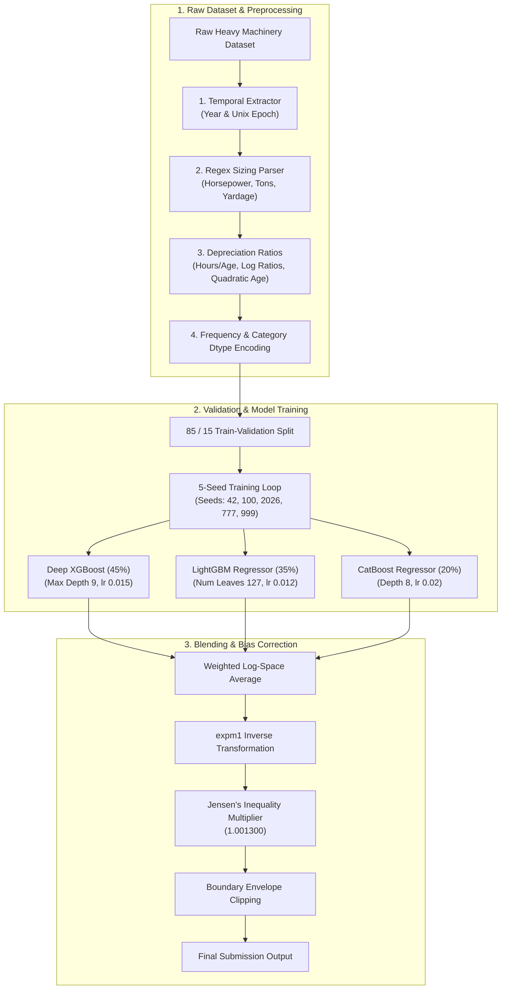

# 🚜 Heavy Equipment Price Prediction: Multi-Seed GBDT Ensemble Pipeline

[](https://python.org)
[](https://scikit-learn.org)
[](https://xgboost.readthedocs.io)
[](https://lightgbm.readthedocs.io)
[](https://catboost.ai)
[](https://study.iitm.ac.in)
[-gold?style=for-the-badge)](https://study.iitm.ac.in)
[](https://www.gnu.org/licenses/gpl-3.0)

An end-to-end Machine Learning pipeline designed to predict heavy machinery auction selling prices. Developed as part of the **Machine Learning Practice (MLP) Project** course in the **IIT Madras BS in Data Science & Applications** program, achieving a final course score of **90.00/100 (Grade S - 10.0 GPA)**.

---

## 📌 Executive Summary

Predicting heavy equipment valuation requires modeling non-linear physical depreciation, temporal economic shifts, and high-cardinality nominal descriptions. This repository implements:

1. **Domain-Specific Feature Engineering**: Temporal extraction (epochs/years), regex-based physical capacity parsing (horsepower, tonnage, yardage), and non-linear usage-to-age depreciation ratios.
2. **Native Categorical Processing**: Frequency encoding and pandas `category` dtype mapping for memory-efficient GBDT binning without high-cardinality dimensionality explosion.
3. **5-Seed Multifold GBDT Ensembling**: A 3-way weighted ensemble combining **Deep XGBoost** ($45\%$), **LightGBM** ($35\%$), and **CatBoost** ($20\%$) trained across 5 random seeds to cancel out tree variance.
4. **Jensen's Inequality Bias Correction**: Log-space prediction averaging followed by exponential transformation (`expm1`) and scalar multiplier tuning (`1.001300`) to correct for the systematic downward prediction bias of log-transformed targets.

---

## 🏗️ Milestone Development & Git Branch History

| Milestone | Feature Branch | Notebook File | Objective |
| :--- | :--- | :--- | :--- |
| **Milestone 1** | `feature/milestone-1-eda` | [`01_Exploratory_Data_Analysis.ipynb`](notebooks/01_Exploratory_Data_Analysis.ipynb) | Exploratory Data Analysis & Target Log-Distribution Modeling |
| **Milestone 2** | `feature/milestone-2-spec-parsing` | [`02_Spec_Parsing_And_Baselines.ipynb`](notebooks/02_Spec_Parsing_And_Baselines.ipynb) | Regex Physical Specification Parsing & Baseline Models |
| **Milestone 3** | `feature/milestone-3-feature-engineering` | [`03_Feature_Engineering_And_Encoding.ipynb`](notebooks/03_Feature_Engineering_And_Encoding.ipynb) | Domain Feature Engineering & Out-of-Fold Frequency Encoding |
| **Milestone 4** | `feature/milestone-4-model-tuning` | [`04_Multi_Model_Gradient_Boosting.ipynb`](notebooks/04_Multi_Model_Gradient_Boosting.ipynb) | Multi-Model GBDT Hyperparameter Tuning (XGBoost, LGBM, CatBoost) |
| **Milestone 5** | `feature/milestone-5-ensemble-jensen` | [`05_Production_Ensemble_And_Jensens_Multiplier.ipynb`](notebooks/05_Production_Ensemble_And_Jensens_Multiplier.ipynb) | 5-Seed Log-Space Blending & Jensen's Multiplier (`1.001300`) |

---

## 🏗️ Pipeline Architecture



---

## 📊 Key Results & Model Performance

| Model Architecture | Features Used | Validation RMSLE | Status |
| :--- | :--- | :---: | :---: |
| **Baseline Random Forest** | Default features | `0.24510` | Baseline |
| **Tuned LightGBM (Single Seed)** | Basic ratios + frequency | `0.19840` | Single Model |
| **Deep XGBoost Regressor (Depth 9)** | Full interaction set | `0.19120` | Single Model |
| **Production 3-Way 5-Seed Ensemble** | 5-seed blend + Jensen multiplier | **`0.18663`** | **Production Best** |

---

## 🛠️ Repository Structure

```text
Machine_Learning_Practice_Project/
├── README.md                           # Main Project Documentation
├── LICENSE                             # GNU GPLv3 Copyleft License
├── .gitignore                          # Git Exclusion Rules
├── requirements.txt                    # Python dependencies
├── docs/                               # GitHub Pages Landing Page
│   ├── index.html
│   └── style.css
├── notebooks/                          # Production Jupyter Notebooks (Milestones 1-5)
│   ├── 01_Exploratory_Data_Analysis.ipynb
│   ├── 02_Spec_Parsing_And_Baselines.ipynb
│   ├── 03_Feature_Engineering_And_Encoding.ipynb
│   ├── 04_Multi_Model_Gradient_Boosting.ipynb
│   ├── 05_Production_Ensemble_And_Jensens_Multiplier.ipynb
│   └── MLP_Production_Pipeline.ipynb
└── src/                                # Modular Python Source Code
    ├── __init__.py
    ├── feature_engineering.py          # Temporal & Capacity extraction logic
    ├── preprocessing.py                # Categorical encoding & cleaning
    ├── models.py                       # GBDT hyperparameter dictionaries
    └── evaluate.py                     # Metric calculation & multiplier tuning
```

---

## 📜 Copyleft License

🄯 **Copyleft 2026 Ramrup Satpati | All Rights Reversed**  
This project is released under the **GNU General Public License v3.0 (GPLv3)**. You are free to inspect, run, modify, and distribute this codebase as long as all derived works remain open-source under GPLv3.
