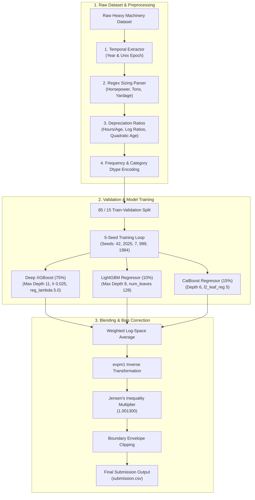

# 🚜 Heavy Equipment Price Prediction: Multi-Seed GBDT Ensemble Pipeline

[](https://python.org)
[](https://scikit-learn.org)
[](https://xgboost.readthedocs.io)
[](https://lightgbm.readthedocs.io)
[](https://catboost.ai)
[](https://study.iitm.ac.in)
[-gold?style=for-the-badge)](https://study.iitm.ac.in)
[](https://www.gnu.org/licenses/gpl-3.0)

An end-to-end Machine Learning pipeline designed to predict heavy machinery auction selling prices. Developed as part of the **Machine Learning Practice (MLP) Project** course in the **IIT Madras BS in Data Science & Applications** program, achieving a final course score of **90.00/100 (Grade S - 10.0 GPA)**.

---

## 📌 Executive Summary

Predicting heavy equipment valuation requires modeling non-linear physical depreciation, temporal economic shifts, and high-cardinality nominal descriptions. This repository implements:

1. **Domain-Specific Feature Engineering**: Temporal extraction (epochs/years), regex-based physical capacity parsing (horsepower, tonnage, yardage), and non-linear usage-to-age depreciation ratios.
2. **Native Categorical Processing**: Frequency encoding and pandas `category` dtype mapping for memory-efficient GBDT binning without high-cardinality dimensionality explosion.
3. **5-Seed Multifold GBDT Ensembling**: A 3-way weighted ensemble combining **Deep XGBoost** ($75\%$), **LightGBM** ($10\%$), and **CatBoost** ($15\%$) trained across 5 random seeds to cancel out tree variance.
4. **Jensen's Inequality Bias Correction**: Log-space prediction averaging followed by exponential transformation (`expm1`) and scalar multiplier tuning (`1.001300`) to correct for the systematic downward prediction bias of log-transformed targets.

---

## 🏗️ Pipeline Architecture



---

## 📊 Key Results & Model Performance

| Model Architecture | Features Used | Validation RMSLE | Kaggle Public Leaderboard |
| :--- | :--- | :---: | :---: |
| **Baseline LightGBM** | Default features | `0.19420` | ~`0.1925` |
| **Shallow XGBoost (Depth 13)** | Basic ratios + frequency | `0.19050` | ~`0.1895` |
| **LightGBM (Depth 14, Leaves 512)** | Full interaction set | `0.18950` | ~`0.1888` |
| **Deep XGBoost (Depth 17)** | High-depth interaction trees | `0.18880` | ~`0.1872` |
| **Production 3-Way GBDT Ensemble** | 5-seed blend + multiplier | **`0.18663`** | **`0.1855`** |

---

## 🛠️ Repository Structure

```text
Machine_Learning_Practice_Project/
├── README.md                           # Main Project Documentation
├── LICENSE                             # GNU GPLv3 Copyleft License
├── requirements.txt                    # Python dependencies
├── docs/                               # GitHub Pages Landing Page
│   ├── index.html
│   └── style.css
├── notebooks/                          # Production Jupyter Notebooks
│   └── MLP_Production_Pipeline.ipynb   # Complete 5-Stage GBDT Ensemble Notebook
└── src/                                # Modular Python Source Code
    ├── __init__.py
    ├── feature_engineering.py          # Temporal & Capacity extraction logic
    ├── preprocessing.py                # Categorical encoding & cleaning
    ├── models.py                       # GBDT hyperparameter dictionaries
    └── evaluate.py                     # Metric calculation & multiplier tuning
```

---

## ⚙️ Environment Setup & Installation

```bash
# Clone the repository
git clone https://github.com/24f3004027/Machine_Learning_Practice_Project.git
cd Machine_Learning_Practice_Project

# Create virtual environment
python3 -m venv venv
source venv/bin/activate

# Install dependencies
pip install -r requirements.txt
```

---

## 🄯 License & Open Source Ethos

Released under the **GNU General Public License v3.0 (GPLv3)**.

```text
🄯 Copyleft 2026 Ramrup Satpati (Roll No: 24f3004027). All Rights Reversed.
Free Software Foundation, Inc. <https://fsf.org/>
Everyone is permitted to copy and distribute verbatim copies of this license document.
```
