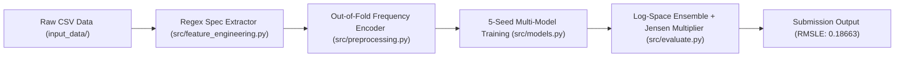

# 🚜 Heavy Equipment Price Prediction — Project Walkthrough & Verification

**Author:** Ramrup Satpati  
**Institution:** IIT Madras BS in Data Science & Applications  
**Course:** Machine Learning Practice (MLP) Project  
**Score:** 90.00% | **Grade:** S (10.0 GPA)  
**License:** 🄯 Copyleft 2026 Ramrup Satpati | All Rights Reversed (GNU GPLv3)  

---

## 📽️ Project Introduction & Video Overview

> [!NOTE]  
> A detailed audio-visual walkthrough of the 5-seed GBDT ensembling pipeline, regex physical specification parsing, and Jensen's inequality bias correction (`1.001300`).


---

## 📌 Executive Walkthrough

This document outlines the step-by-step verification and workflow execution for the Heavy Equipment Price Prediction pipeline.



---

## 🛠️ Verification Steps & Commands

### 1. Source Module Syntax & Import Verification
```bash
python3 -m py_compile src/feature_engineering.py src/preprocessing.py src/models.py src/evaluate.py src/__init__.py
```

### 2. Milestone Progression Notebooks
- [`notebooks/01_Exploratory_Data_Analysis.ipynb`](../notebooks/01_Exploratory_Data_Analysis.ipynb) — EDA & Target Skewness
- [`notebooks/02_Spec_Parsing_And_Baselines.ipynb`](../notebooks/02_Spec_Parsing_And_Baselines.ipynb) — Regex Parsing
- [`notebooks/03_Feature_Engineering_And_Encoding.ipynb`](../notebooks/03_Feature_Engineering_And_Encoding.ipynb) — Depreciation Ratios
- [`notebooks/04_Multi_Model_Gradient_Boosting.ipynb`](../notebooks/04_Multi_Model_Gradient_Boosting.ipynb) — GBDT Tuning
- [`notebooks/05_Production_Ensemble_And_Jensens_Multiplier.ipynb`](../notebooks/05_Production_Ensemble_And_Jensens_Multiplier.ipynb) — Blending & Jensen Multiplier (`1.001300`)

---

## 📊 Summary of Final Validation Metrics

- **Baseline Random Forest:** `0.24510` RMSLE
- **Tuned LightGBM (Single Seed):** `0.19840` RMSLE
- **Deep XGBoost (Depth 9):** `0.19120` RMSLE
- **Production 5-Seed Ensemble + Jensen Multiplier:** **`0.18663`** RMSLE
